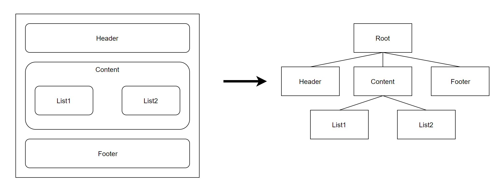

# VUE

* [Vue.js?](#vuejs)

[뒤로](https://github.com/SeongYongLee/TIL)

## Vue.js?

오픈소스 자바스크립트 프레임워크

동적인 사용자 인터페이스(UI) 를 만들기 위한 프로그래시브 프레임워크

Vue는 1명의 개발자 Evan You(에번 유)에 의해서 제작되었다. Even You가 2014년도에 발표, Even You는 현재 Vue 의 유지보수를 전업으로 하고 있다.

### 컴포넌트 기반 프레임워크



컴포넌트란 레고 블록을 조합하는 것과 비슷하다. 즉, 화면을 왼쪽 같이 구성을 하면 오른쪽과 같은 컴포넌트 트리 구조를 가지게 되는 것이다. 이러한 컴포넌트 기반의 프레임워크를 사용함으로써 코드의 재사용성이 향상되며 직관적인 화면 구조를 갖게 되는 것이다.

### MVVM 패턴과 비슷하다.

MVVM은 단방향 데이터 플로우로 동작하는데, Vue.js는 MVVM처럼 사용자가 인터페이스를 다루는 위치인 Layout 까지 모델, 뷰모델을 거쳐 단방향으로 동작하지만, Layout Component에서 데이터를 받을때는 emit, on 등의 메서드를 통해서 부모로 데이터를 전달하기 때문에 부분적 양방향 통신이 이루어진다. 그래서 Vue.js는 MVVM의 개념과 비슷하지만 다른 프레임워크라고 표현할 수 있다.

### Single File Component

Single File Component는 컴포넌트 하나에서 template, script, style의 3개의 영역으로 나누어서 부분별로 작성하여 한 파일내에 볼 수 있는 파일 시스템이다. 그렇기 때문에 디자이너와의 협업에서 강력해지고 scss등의 모듈 붙이기도 수월하다.

- 단점
    - 한 개의 Component가 많은 일을 처리하게 될 경우 소스코드가 길어지는 문제가 있는데 이를 React에서는 작게 class혹은 function을 만들어 처리할 수 있지만 Vue는 Single File Component를 새로 만들어서 해야하며 파일이 많아지게 된다.

### React의 가상 돔 기반 렌더링 특성

내부적으로 Vue는 템플릿을 가상 DOM 렌더링 함수로 컴파일 한다. 반응형 시스템과 결합된 Vue는 앱 상태가 변경 될 때 최소한으로 DOM을 조작하고 다시 적용할 수 있는 최소한의 컴포넌트를 지능적으로 파악할 수 있다.

### Template - Angular의 데이터 바인딩 특성

HTML + CSS + JS의 특징을 각각 살리자는게 뷰의 목표로 전통적인 웹 개발 패러다임(HTML과 Javascript의 기본)과 유사하다.

Vue는 기본적으로 렌더링 된 DOM을 기본 Vue 인스턴스의 데이터에 선언적으로 바인딩 할 수있는 HTML 기반 Template 구문을 사용하여 HTML 파일에 마크업을 작성한다.

콧수염 괄호 `{{}}`를 사용해 데이터 바인딩을 하고, 표준 HTML 태그 이외에 디렉티브(Directive - v-show, v-model)라는 특별 HTML Attribute를 이용해 Template의 기능을 확장 할 수 있다.

모든 Vue.js Template은 스펙을 호환하는 브라우저 및 HTML 파서로 구문 분석 할 수있는 유효한 HTML이다.

**Vue 2.x부터 Template와 render()를 모두 지원하게 되었다.**
- 가상 DOM 개념에 익숙하고 JavaScript의 기본 기능을 선호하는 경우 템플릿 대신 렌더링 함수를 직접 작성할 수 있으며 선택사항으로 JSX를 지원한다.

차이점
- React는 일반적으로 `HTML, CSS 조차도 자바스크립트로 다 해버리자.`라는 느낌으로 JSX(Html + Js)와 ES6에 의존을 많이 하고 있다.

- React는 Template 구조를 사용하지 않고, JSX를 사용해 자바스크립트에서 렌더링 시스템으로 DOM을 생성한다.

- Angular는 Vue와 비슷하게 데이터 바인딩을 하고, 디렉티브도 Angular의 ng-if와 비슷하다.

- Anguler는 Typescript를 사용하며, 컴포넌트, 모듈, 구문이 Javascript와는 많이 다르다.  Angular는 강력한 기능들이 많이 내장되어 있어 이 기능들을 사용하려면 Angular에 맞는 특정 패턴으로 코딩해야 한다.

장점
- Template에 기반한 앱은 가독성이 더 좋고 입문 개발자가 이해하기 쉽다. 심지어 숙련된 개발자분들께도 Functionality 동작과 태그 Layout 을 분리할 수 있어 선호되는 방식이다. Pug와 같은 전처리기를 추가할 수 있는 옵션도 생긴다.

- 간편한 Syntax로 Learning Curve가 낮다.

단점
- Template은 표준 HTML 이외에 추가적인 HTML 구문을 학습해야 한다는 단점이 있다. React 의 render() 는 표준 HTML 과 Javascript만 알면 되며 render()는 쉽게 디버깅 하고 테스팅이 가능한 장점이 있다.

- 복잡한 어플리케이션을 만들수록 더 복잡해진다.
    - Template의 초기의 혜택들이 앱의 규모가 점점 더 커질 때 기술 부채를 안겨준다.  Template은 런타임 에러가 나오기 쉽고, 테스트하기가 어려우며 재구조화 하기 어렵기 때문이다. 반대로, Javascript 으로 만들어진 Template 은 컴포넌트로 구성하기 쉽고, 재사용성이 높으며 테스트 하기가 용이하다.

- React의 렌더링 시스템이 더 정밀한 구성이 가능하고, shallow 렌더링 과 같은 기능들을 갖고있다. 테스팅 도구와도 결합할 수 있어, 테스트하기 수월하고 더 유지보수 가능한 코드를 만들 수 있다.

### 빠른 렌더링과 더 작은 용량

두 라이브러리 React, Vue가 어떻게 application data(state)를 처리하는지 살펴보면

React 에서 state 는 불변(immutable) 의 속성을 가진다. 그래서 직접적으로 변경할 수 없고 만약 상태를 변경하고 싶다면 아래처럼 setState()를 사용해야 한다.

```
this.setState({
    message: this.state.message.split('').reverse().join('')
});
```

현재와 이전 상태를 비교해 언제, 어떻게 다시 DOM을 렌더링 할 지 결정하기 때문에 불변하는 속성이 필요하다.

반대로, Vue에서 data는 변경될 수 있다.

```
this.message = this.message.split('').reverse().join('');
```

state에 새로운 객체를 추가했을 때, Vue가 해당 객체의 모든 속성을 확인하고나서 getter, setter로 변환한다. Vue의 reacivity system이 모든 상태를 모니터링하여 변경이 일어날 때마다 자동으로 DOM을 다시 렌더링 한다.

더 인상적인 부분은 Vue에서 state를 간단하게 변경할 수 있을 뿐만 아니라, Vue의 렌더링 시스템이 React보다 빠르고 더 효율적이다.

Vue 의 reactivity system 에도 몇가지 주의할 점이 있다. 예를 들어, 속성 추가 및 삭제 그리고 특정 배열에 대한 변경을 감지하지 못한다. 물론 이러한 부분들을 React 처럼 Vue set() API 로 해결할 수 있다.

### React와 Angular에 비해 아직 생태계 구축이 많이 되지 않았다.

더 큰 개발자 생태계에서 오는 많은 레퍼런스와 도구들은 매우 매력적이다.

채용시장에서도 React가 압도적이다.

### TypeScript 지원이 아직 부족하다. (Vue 3.0을 기대해봐야 한다.)

### Recommend
큰 규모의 앱, 더 큰 개발 생태계를 원한다면 React

상대적으로 프론트엔드에 익숙하지 않은 팀원이 많이 참여하거나 소규모의 오래 유지보수하지 않을 프로젝트라면 Vue가 좋은 선택이 될 것이다.

### Reference
- [https://joshua1988.github.io/web_dev/vue-or-react](https://joshua1988.github.io/web_dev/vue-or-react)
- [https://velog.io/@poburi/Vue-장단점-feat.-리액트](https://velog.io/@poburi/Vue-%EC%9E%A5%EB%8B%A8%EC%A0%90-feat.-%EB%A6%AC%EC%95%A1%ED%8A%B8)
- [https://coding-start.tistory.com/213](https://coding-start.tistory.com/213)


[뒤로](https://github.com/SeongYongLee/TIL)/[위로](#vue)